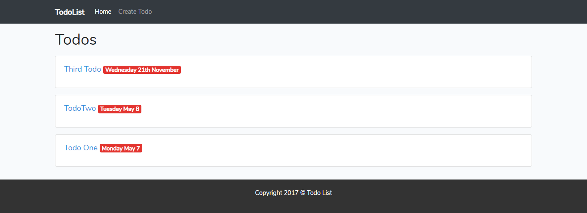

# Todo List-Laravel-project

## Table of Contents

* [Description](#Description)
* [Dependencies](#dependencies)

## Description

This project is Todo List Website which I used PHP and Laravel to create. The Todo List application allow users create the Todo List and save into the database.

## Achievements
* Tinker to interact with database
* Blade templating including layouts and includes
* CRUD functionality
* Twitter Bootstrap

The following photo is the Home page:

## Dependencies

The project is cooperated with a PHP framework is Laravel, a JavaScript framework is Bootstrap and MySQL Database.
